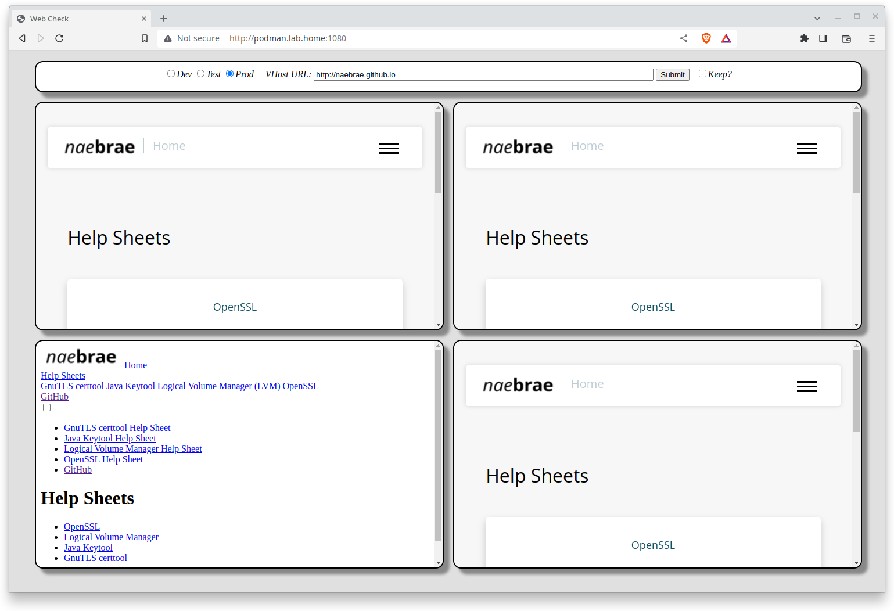
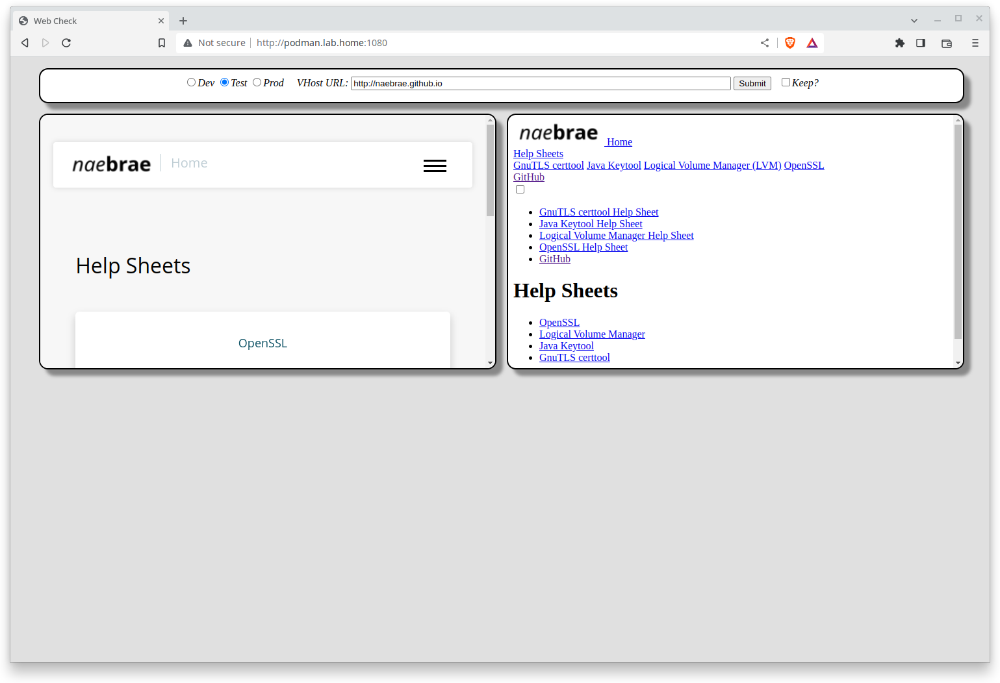

# php_webchk

## Description

PHP script to show web servers behind load balancer. It sends the URL specified to the configured web servers behind the load balancer that the URL points to and returns the response in iframes. It supports dev, test, and production web servers.


## Usage

1. Simply copy the index.php to an existing PHP capable web server. It requires the ***php-openssl*** package.

    ```
    cd /var/www/html
    git clone https://github.com/naebrae/php_webchk.git webchk
    vi webchk/html/servers.php
    ```
    ```
    curl http://localhost/webchk/html/
    ```

2. Docker or Podman

    > Note: this example doesn't release the terminal. Add -dt to the run command to detach the terminal and run in the background.
    > This maps the local folder in to the docker container so that the file can be edited with out having to rebuild or restart the container.

    ```
    git clone https://github.com/naebrae/php_webchk.git webchk
    cd webchk
    vi html/servers.php
    podman build -t webchk .
    podman run -p 1080:80 -p 1443:443 -v ./html/:/var/www/html localhost/webchk
    ```
    ```
    curl http://localhost:1080
    ```

3. Docker-compose

    > Note: this example doesn't release the terminal. Add -d to the up command to detach the terminal and run in the background.
    > This maps the local folder in to the docker container so that the file can be edited with out having to rebuild or restart the container.

    ```
    git clone https://github.com/naebrae/php_webchk.git webchk
    cd webchk
    vi html/servers.php
    sudo docker-compose build
    sudo docker-compose up
    ```
    ```
    curl http://localhost:1080
    ```

## Screenshots

These show that the CSS on the production websrv03 and test websrv02 is broken. There is four production web servers but only two test web servers.


### 1. URL to production web servers.



### 2. URL to test web servers.


